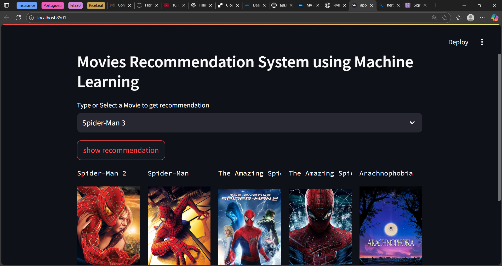

# 🎬 Movie Recommendation System

A simple **Movie Recommendation System** built with **Python** and **Streamlit**.  
It recommends the top 5 movies similar to the one you select, along with their posters.

---

## 🚀 Features

- Recommend movies based on **tags, genres, and descriptions**
- Displays **movie posters** alongside recommendations
- Fast and interactive **web interface** using Streamlit
- Easy to deploy and share

---

## 🧩 Demo

Here’s how the Movie Recommendation System looks in action 👇




---

## ⚙️ Installation

1. **Clone the repository:**

```bash
git clone https://github.com/Sarumathi17/Movie-Recommender.git
cd Movie-Recommender
```
2. **Install dependencies:**

```bash
pip install -r requirements.txt
```

--- 

## Usage

Run the Streamlit app:
```bash
streamlit run app.py
```
* Select a movie from the dropdown.
* Click "Show Recommendation".
* See the top 5 recommended movies with posters.

---

## 📁 Files in the Project

| File | Description |
|------|--------------|
| `Movie recommender.ipynb` | Jupyter Notebook used to build and generate required `.pkl` files |
| `app.py` | Main Streamlit application file |
| `movie_list.pkl` | Pickle file containing movie metadata |
| `similarity.pkl` | Pickle file containing precomputed similarity matrix |
| `README.md` | Project documentation |
| `requirements.txt` | List of Python packages required |
| `assets/` | Folder for images/screenshots |

---

## ⚙️ If `similarity.pkl` Is Missing

The file `similarity.pkl` is not included in this repository because it exceeds GitHub’s 25 MB file size limit.  
You can easily generate it yourself by running the Jupyter Notebook.

### 🧾 Steps to Generate Required Files

1. Open the notebook file (`Movie recommender.ipynb`) in Jupyter Notebook or VS Code.  
2. Run all the cells — it will automatically create:
   - `movie_list.pkl`
   - `similarity.pkl`
3. After successful execution, both files will appear in your project folder.  
4. Now you can run the Streamlit app as usual:

```bash
streamlit run app.py
```

---

## 🧠 How It Works

1. Text Processing:
Combines movie tags, genres, cast, and descriptions into a single text field.

2. Vectorization:
Uses CountVectorizer to convert text into numerical vectors.

3. Similarity Calculation:
Computes cosine similarity between movie vectors.

4. Recommendation:
For the selected movie, retrieves the top 5 most similar movies.

5. Visualization:
Displays the movie titles and posters on the Streamlit app.

---

## 🧾 Requirements

* Python 3.10 or above
* Packages listed in requirements.txt:
```bash
streamlit
pandas
numpy
scikit-learn
requests
```

---

---

## Acknowledgement

This project was created with reference to a YouTube tutorial for learning purposes.  
While I followed the video as a guide, all implementation steps — including data processing, vectorization, and app development — were done by me.  
Full credit goes to the original creator for the tutorial inspiration.
